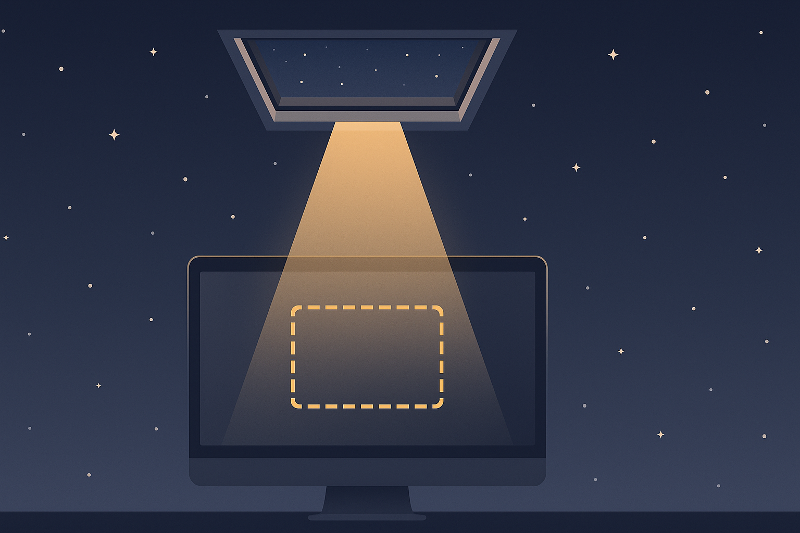

# Skylight



Share one part of your screen in any app that can share a window.

Skylight is a macOS menu bar utility. You select a part of your screen with a
border rectangle. Skylight shows that region, live, in a normal window titled
"Skylight — Shared Region". In Zoom, Google Meet, OBS, or any other app, you
share that window. Viewers see only the selected part. This is the "share
portion of screen" feature from Zoom, made generic — and window sharing is
the path every conferencing app makes easy.

## Features

- Movable, resizable selection border to pick the region. The viewport is
  fixed once sharing starts, so nothing blocks your windows during a call.
- The selection opens with your last shared viewport preselected.
- Named region presets. Save a region once, recall it from the menu.
- Global hotkey to start and stop sharing.
- A setting to show or hide the cursor in the shared output.
- Only public APIs. No private interfaces, no App Store blockers.

## How it works

ScreenCaptureKit captures the selected region as a video stream. Skylight
renders the frames into a normal window. Your conferencing app shares that
window like any other. The mirror window is excluded from Skylight's own
capture, so dragging it over the captured region never produces a recursive
"hall of mirrors".

## Requirements

- macOS 14.0 or later (verified on macOS 26.5)
- Xcode with the macOS 14 SDK or later
- Homebrew packages: `xcodegen`, `swiftformat`, `swiftlint`

## Build and run

1. Install the tools: `brew install xcodegen swiftformat swiftlint`.
2. Run `scripts/release.sh`. The script builds the app and installs it to
   `/Applications/Skylight.app`. Run the app from there — macOS keeps the
   Screen Recording grant only for an app in a stable location, not a build
   folder. (For a quick Debug build in place, use `scripts/run.sh` instead.)
3. At first launch, macOS asks for Screen Recording permission. Grant it
   in System Settings → Privacy & Security → Screen Recording.
4. Start the app again. macOS applies the permission only after a restart
   of the app.

After a code change, run `scripts/release.sh` again. It quits the running
copy and reinstalls; the stable signing identity keeps the existing grant,
so macOS does not prompt again.

## Usage

1. Click the Skylight icon in the menu bar. Select "Start Sharing…".
2. Move and resize the yellow border until it covers the part you want to
   share. Press Return, or click the "Start Sharing" button in its center.
   The border disappears and the "Skylight — Shared Region" window appears.
3. In your conferencing app, choose to share a window, and pick "Skylight —
   Shared Region". You can move or resize that window, or park it on another
   Space; it keeps sharing. Do not minimize it.
4. To stop, close the window, select "Stop Sharing" from the menu bar icon,
   or press the hotkey. To share a different part, stop and start a new
   share — the viewport is fixed while a share runs.

To save the current region as a preset, select "Save Current Region…" while
a share runs. To set the hotkey and the cursor option, select "Settings…".

## Development

```sh
xcodegen generate                          # regenerate Skylight.xcodeproj
xcodebuild -project Skylight.xcodeproj -scheme Skylight \
  -destination 'platform=macOS,arch=arm64' test        # run all tests
xcodebuild -project Skylight.xcodeproj -scheme Skylight \
  -destination 'platform=macOS,arch=arm64' test \
  -only-testing:SkylightTests/GeometryTests            # run one test class
swiftformat . && swiftlint                 # format and lint
scripts/release.sh                         # build and install to /Applications
```
